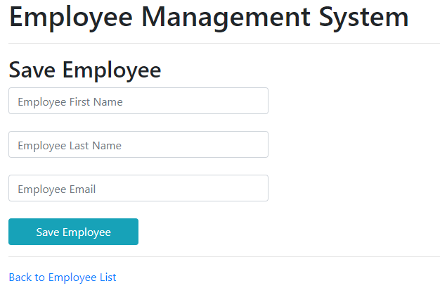
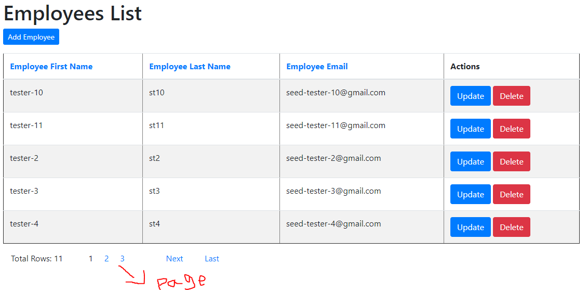
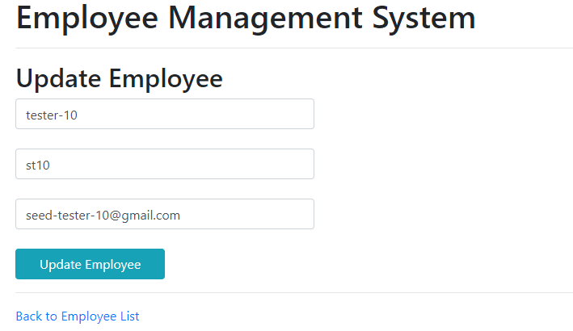
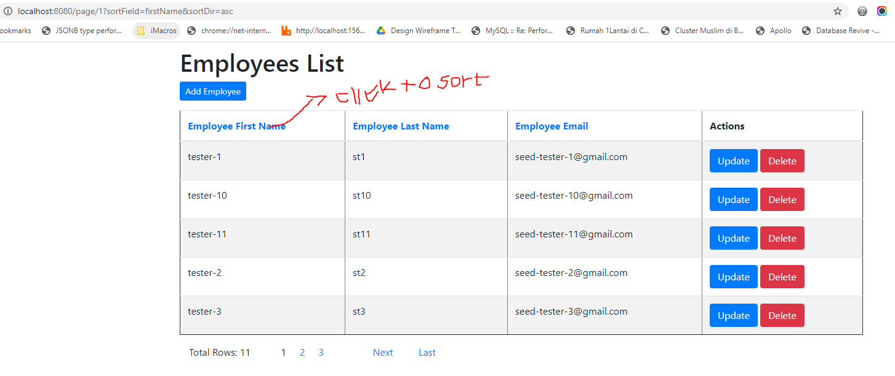

Stacks
=============

1. Java (11.0.10)
2. MVN 3.3.9
3. Mysql
4. Spring boot framework1.5.1
5. JPA, Hibernate, log4j2, thymeleaf

How To Install 
=============

1. clone from github ` git clone https://github.com/viyancs/Viyancs-Spring-Boot.git viyancs-test` 
2. `cd viyancs-test`
3. open file `src/main/resources/application.properties` and modify database part connection

<pre>------

spring.datasource.url=jdbc:mysql://localhost:3306/vyn_test?useUnicode=true&useJDBCCompliantTimezoneShift=true&useLegacyDatetimeCode=false&serverTimezone=UTC
spring.datasource.username=root
spring.datasource.password=

------</pre>

fill the username,password and data source mysql connection, make sure you create database first!

3. Migration table will automatically sync using  `spring.jpa.hibernate.ddl-auto = create-drop` 
4. Sample data will automatically insert  `spring.datasource.data=classpath:import.sql` 
5. next is run application by run `./mvnw spring-boot:run`
6. go `http://localhost:8080/` to access the site

Run With Jar
===========
1. `.\mvnw clean package spring-boot:repackage`
2. `java -jar .\target\vyn-test-app-0.0.1-SNAPSHOT.jar`

Accessing Logs
============

`tail -f logs/spring-boot-logger.log`

for change level logging  open `application.properties` change this configuration `logging.level.root=INFO` to `DEBUG`, `TRACE`, `ERROR`, `WARN`

User Guide
==========
Add
----

    

List
----

    

Update
----

    

Sort
----

    

